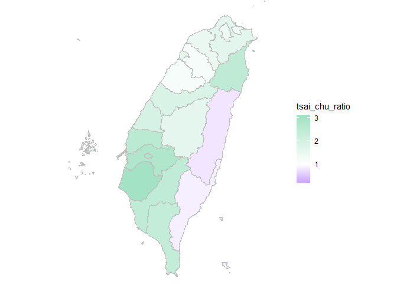
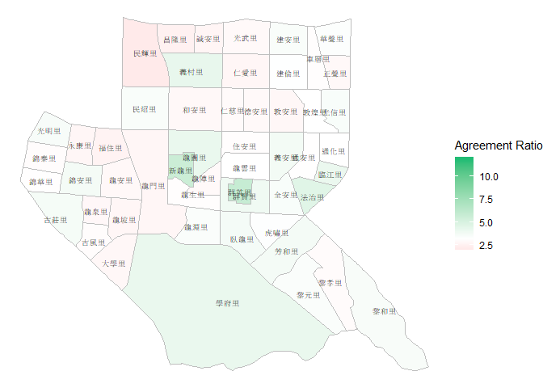

Map
================

-   [County](#county)
-   [Village](#village)

``` r
options(stringsAsFactors = F)

library(rgdal)
library(tidyverse)
```

County
======

``` r
shp <- readOGR('county shp/COUNTY_MOI_1070516.shp', encoding = 'utf-8', stringsAsFactors = F)
```

    ## OGR data source with driver: ESRI Shapefile 
    ## Source: "C:\Users\user\Documents\Work\Map\county shp\COUNTY_MOI_1070516.shp", layer: "COUNTY_MOI_1070516"
    ## with 22 features
    ## It has 4 fields

``` r
shp@data$COUNTYNAME <- iconv(shp@data$COUNTYNAME, "utf-8")
```

``` r
president_vote <- readxl::read_xlsx('president.xlsx') %>% 
  mutate(total = chu + tsai + song) %>% 
  mutate(chu_ratio = chu / total,
         tsai_ratio = tsai / total,
         song_ratio = song / total,
         tsai_chu_ratio = tsai / chu)
```

``` r
#如果遇到error，可能是需要install.packages("maptools")、install.packages("rgeos")
#不確定是要裝哪個，都裝之後work了

shp_df <- broom::tidy(shp, region = 'COUNTYNAME') %>% 
  left_join(president_vote, by = c('id' = 'county'))
```

``` r
#install.packages('mapproj')
shp_df %>% 
  ggplot() + 
    geom_polygon(aes(x = long, y = lat, group = group,fill = tsai_chu_ratio), colour = 'gray')+
    scale_fill_gradient2(high = "#a3e2c5", low = "#2200ff", midpoint = 1) +
    ggplot2::coord_map(xlim = c(119, 122.5), ylim = c(21.8, 25.5)) +
    theme_void()
```

 \#Town

``` r
shp <- readOGR('town/TOWN_MOI_1071226.shp', encoding = 'utf-8', stringsAsFactors = F)
```

    ## OGR data source with driver: ESRI Shapefile 
    ## Source: "C:\Users\user\Documents\Work\Map\town\TOWN_MOI_1071226.shp", layer: "TOWN_MOI_1071226"
    ## with 368 features
    ## It has 7 fields

``` r
shp@data <- shp@data %>% 
  mutate(TOWNNAME = iconv(TOWNNAME, "utf-8"), COUNTYNAME = iconv(COUNTYNAME, "utf-8"))
```

``` r
taipei_income <- readxl::read_xlsx('台北各區每人所得.xlsx') 
taipei_town <- shp@data %>% filter(COUNTYNAME == "臺北市")
```

``` r
shp_df <- broom::tidy(shp, region = 'TOWNNAME') %>% 
  filter(id %in% taipei_town$TOWNNAME) %>% 
  left_join(taipei_income, by = c("id" = "district"))
```

``` r
library(jsonlite)
twzipcode_json <- fromJSON("twzipcode.json")[[1]]
taipei_zipcode <- twzipcode_json %>% 
  filter(city == "台北市")
```

``` r
shp_df %>% 
  ggplot() + 
    geom_polygon(aes(x = long, y = lat, group = group, fill = income), colour = 'gray')+
    scale_fill_gradient2(low = "#fbe0fc", high = "#a3e2c5", midpoint = median(shp_df$income))+
    geom_text(data = taipei_zipcode, aes(x = lng, y = lat, label = district), color = "black", size = 2.5)+
    ggplot2::coord_map(xlim = c(121.4, 121.7), ylim = c(25.22, 24.95))+
    theme_void()
```


Village
=======

``` r
shp <- readOGR('vil/VILLAGE_MOI_121_1071226.shp', encoding = 'utf-8', stringsAsFactors = F)
```

    ## OGR data source with driver: ESRI Shapefile 
    ## Source: "C:\Users\user\Documents\Work\Map\vil\VILLAGE_MOI_121_1071226.shp", layer: "VILLAGE_MOI_121_1071226"
    ## with 7669 features
    ## It has 10 fields

``` r
shp@data <- shp@data %>% 
  mutate(TOWNNAME = iconv(TOWNNAME, "utf-8"),
         COUNTYNAME = iconv(COUNTYNAME, "utf-8"),
         VILLNAME = iconv(VILLNAME, "utf-8"))
```

``` r
Daan_vil <- shp@data %>% filter(COUNTYNAME == "臺北市" & TOWNNAME == "大安區")

#broom::tidy辦法一次選大於一層的region，但filter(VILLNAME=="XX里")可能出現好幾個同樣名字的里，沒辦法限制在大安區。上面畫台北市的圖的時候是在最後畫圖階段才把多出的區域剪掉，這次則是先選出台北市最大的經緯度，再選出大安區最大可能的經緯度，最後選出所有在大安區的里時，再把不再這個經緯度範圍的里(也就是名字相同但不是台北市大安區的里)篩除

#找出台北最大的經緯度
shp_df_county <- broom::tidy(shp, region = 'COUNTYNAME')
taipei_endpoint <- shp_df_county %>%
  filter(id == "臺北市") %>% 
  summarise(max_long = max(long),
            min_long = min(long),
            max_lat = max(lat),
            min_lat = min(lat))

#找出台北是大安區最大的經緯度
shp_df_town <- broom::tidy(shp, region = 'TOWNNAME')
daan_endpoint <- shp_df_town %>% 
  filter(id == "大安區") %>% 
  filter(long <= taipei_endpoint$max_long & long >= taipei_endpoint$min_long) %>% 
  filter(lat <= taipei_endpoint$max_lat & lat >= taipei_endpoint$min_lat) %>% 
  summarise(max_long = max(long),
            min_long = min(long),
            max_lat = max(lat),
            min_lat = min(lat))

shp_df_vil <- broom::tidy(shp, region = 'VILLNAME') 

shp_df <- shp_df_vil %>%
  filter(id %in% Daan_vil$VILLNAME) %>% 
  filter(long <= daan_endpoint$max_long & long >= daan_endpoint$min_long) %>% 
  filter(lat <= daan_endpoint$max_lat & lat >= daan_endpoint$min_lat)
```

``` r
daan_14 <- readxl::read_xlsx('daan_14.xlsx') %>% 
  mutate(`Agreement Ratio` = Yes/No)
```

``` r
#用經緯度的極值之平均算文字的位子
text_df <- shp_df %>% 
  group_by(id) %>% 
  summarise(max_long = max(long),
            min_long = min(long),
            max_lat = max(lat),
            min_lat = min(lat)) %>% 
  mutate(long_c = (max_long+min_long)/2, lat_c = (max_lat+min_lat)/2)
```

``` r
shp_df %>% 
  left_join(daan_14, by = c("id" = "vil")) %>% 
  ggplot()+
  geom_polygon(aes(x = long, y = lat, group = group, fill = `Agreement Ratio`), colour = 'gray') + 
  scale_fill_gradient2(low = "#e03a58", high = "#21bc74",
                       midpoint = median(daan_14$`Agreement Ratio`),
                       name = 'Agreement Ratio') +
  theme_void()+
  geom_text(data=text_df, aes(x = long_c, y = lat_c, label = id), color = "black", size = 2.5)
```


